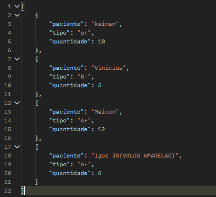
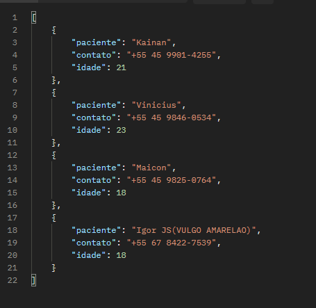
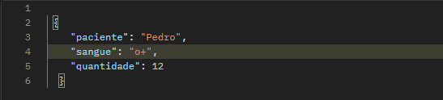
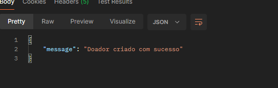
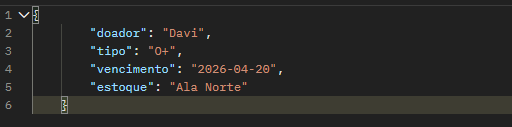
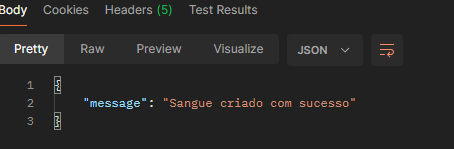

# 📂 Documentação da API - Doação de Sangue

##  GET /sangue

- Arquivo: sangue.json

- O que faz: Exibe o volume de sangue coletado.

- Foco: Mostra o nome do paciente, o tipo sanguíneo e a quantidade (ml).

Controle de entrada de bolsas por doação.Este arquivo JSON armazena uma lista de pacientes, contendo o nome, tipo sanguíneo e uma quantidade associada a cada um. Ele é utilizado para organizar e facilitar o controle dessas informações dentro do sistema, podendo representar dados como estoque, necessidade ou registros relacionados ao sangue.

http://127.0.0.1:5000/sangue

##  GET /doadores
- Arquivo: doadores.json

- O que faz: Exibe o cadastro dos voluntários.

- Foco: Mostra o nome, o contato (WhatsApp/Telefone) e a idade.

- Uso: Localizar o doador para triagem ou convocação.

Este arquivo JSON representa a resposta de uma requisição do tipo GET, retornando uma lista de doadores/pacientes com informações como nome, contato e idade. Ele é utilizado para permitir a consulta e visualização desses dados dentro do sistema.

http://127.0.0.1:5000/doadores

## GET /estoque
- Arquivo: estoque.json

- O que faz: Exibe a logística das bolsas no hospital.

- Foco: Mostra o tipo, a data de vencimento e o setor (ex: Ala Norte).

- Uso: Gestão de validade para não desperdiçar sangue.

Este arquivo JSON representa a resposta de uma requisição do tipo GET, contendo uma lista de bolsas de sangue em estoque. Cada item inclui o doador, tipo sanguíneo, data de vencimento e o setor de armazenamento. Ele é utilizado para consulta e monitoramento do estoque.

http://127.0.0.1:5000/estoque

# 📂 Documentação da API - Doação de Sangue (POST) 

##  POST /doadores
- Arquivo: estoque.json
- O que faz: Armazena as informações do estoque de sangue.

- Foco: Contém o tipo sanguíneo e a quantidade disponível.
- Uso: Utilizado para controle e atualização do estoque de sangue no sistema.

Este arquivo JSON representa os dados do estoque de sangue, podendo ser atualizado através das rotas POST da API. Cada item informa o tipo sanguíneo e a quantidade disponível, permitindo o gerenciamento e monitoramento do estoque.

##  POST /estoque
- Arquivo: estoque.json
- O que faz: Armazena as informações das bolsas de sangue no estoque.
- Foco: Contém dados como doador, tipo sanguíneo, data de vencimento e local de armazenamento (ex: Ala Norte).

- Uso: Utilizado para controle, organização e monitoramento das bolsas de sangue disponíveis.

## POST /sangue
- Arquivo: sangue.json
- O que faz: Armazena os registros de doações de sangue realizadas.
- Foco: Contém o nome do doador, tipo sanguíneo e a quantidade de sangue doada.
- Uso: Utilizado para controlar as doações e acompanhar a quantidade de sangue disponível por tipo.

Este arquivo JSON representa uma lista de doações registradas no sistema através de requisições do tipo POST. Cada item inclui o nome do paciente (doador), o tipo sanguíneo e a quantidade doada. Ele é utilizado para controle das doações e apoio na gestão do estoque de sangue.

