# 📂 Documentação da API - Doação de Sangue

##  GET /sangue

- Arquivo: sangue.json

- O que faz: Exibe o volume de sangue coletado.

- Foco: Mostra o nome do paciente, o tipo sanguíneo e a quantidade (ml).

Controle de entrada de bolsas por doação.Este arquivo JSON armazena uma lista de pacientes, contendo o nome, tipo sanguíneo e uma quantidade associada a cada um. Ele é utilizado para organizar e facilitar o controle dessas informações dentro do sistema, podendo representar dados como estoque, necessidade ou registros relacionados ao sangue.

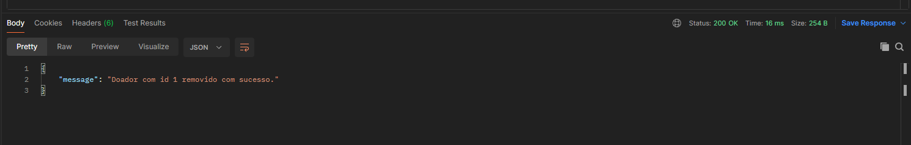

http://127.0.0.1:5000/sangue

##  GET /doadores
- Arquivo: doadores.json
- Endpoint: `/doadores`
- Método HTTP: GET
- Parâmetros: nenhum

- O que faz: Retorna a lista completa de doadores cadastrados.
- Uso: Consultar todo o cadastro de voluntários.

Comportamento esperado:
- Sem parâmetros de query: retorna todos os doadores com status `200`.
- Esta rota não faz filtro por query, apenas retorna a lista completa.

Este arquivo JSON representa a resposta de uma requisição do tipo GET, retornando uma lista de doadores/pacientes com informações como nome, contato e idade. Ele é utilizado para permitir a consulta e visualização desses dados dentro do sistema.

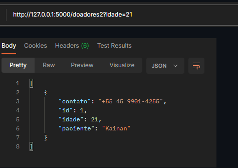

http://127.0.0.1:5000/doadores

## GET /doadores2
- Arquivo: doadores.json
- Endpoint: `/doadores2`
- Método HTTP: GET
- Parâmetros de query:
  - `paciente` (string, opcional)
  - `idade` (inteiro, opcional)

- O que faz: Retorna uma lista de doadores filtrada por nome do paciente e/ou idade.
- Uso: Buscar doadores que correspondam aos filtros informados.

Comportamento esperado:
- Quando houver itens correspondentes aos parâmetros de query: retorna a lista filtrada com status `200`.
- Quando nenhum item corresponder ao filtro: retorna lista vazia `[]` com status `200`.
- Quando nenhum parâmetro for informado: retorna todos os doadores cadastrados com status `200`.

Exemplo:
- `GET /doadores2?paciente=Maria&idade=30`

## GET /estoque
- Arquivo: estoque.json

- O que faz: Exibe a logística das bolsas no hospital.

- Foco: Mostra o tipo, a data de vencimento e o setor (ex: Ala Norte).

- Uso: Gestão de validade para não desperdiçar sangue.

Este arquivo JSON representa a resposta de uma requisição do tipo GET, contendo uma lista de bolsas de sangue em estoque. Cada item inclui o doador, tipo sanguíneo, data de vencimento e o setor de armazenamento. Ele é utilizado para consulta e monitoramento do estoque.

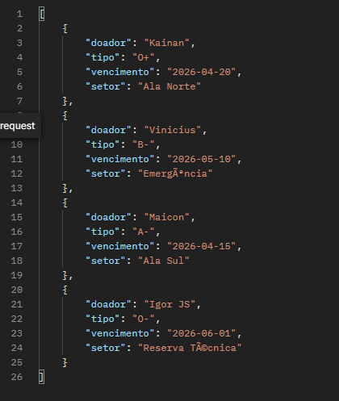

http://127.0.0.1:5000/estoque

# 📂 Documentação da API - Doação de Sangue (POST) 

##  POST /doadores
- Arquivo: doadores.json
- O que faz: Armazena as informações de um novo doador.

- Foco: Contém o nome do paciente, contato e idade.
- Uso: Utilizado para cadastro e atualização do registro de voluntários no sistema.

Este arquivo JSON representa os dados dos doadores cadastrados no sistema. Cada item informa o nome do paciente, contato e idade, permitindo o cadastro, consulta e monitoramento dos voluntários.

##  POST /estoque
- Arquivo: estoque.json
- O que faz: Armazena as informações das bolsas de sangue no estoque.
- Foco: Contém dados como doador, tipo sanguíneo, data de vencimento e local de armazenamento (ex: Ala Norte).

- Uso: Utilizado para controle, organização e monitoramento das bolsas de sangue disponíveis.

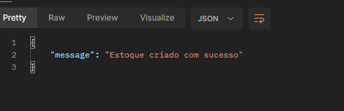

## POST /sangue
- Arquivo: sangue.json
- O que faz: Armazena os registros de doações de sangue realizadas.
- Foco: Contém o nome do doador, tipo sanguíneo e a quantidade de sangue doada.
- Uso: Utilizado para controlar as doações e acompanhar a quantidade de sangue disponível por tipo.

Este arquivo JSON representa uma lista de doações registradas no sistema através de requisições do tipo POST. Cada item inclui o nome do paciente (doador), o tipo sanguíneo e a quantidade doada. Ele é utilizado para controle das doações e apoio na gestão do estoque de sangue.

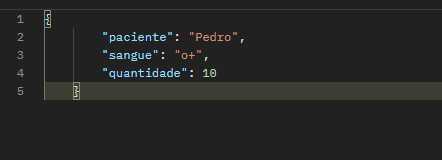

##  VALIDAÇÃO/doadores
- Arquivo: Endpoint /doadores (API Flask)
- O que faz: Recebe e valida dados de doadores enviados via requisição POST.
- Foco: Verifica se o campo paciente existe e se é do tipo texto (string), utilizando isinstance.
- Uso: Utilizado para garantir que os dados enviados para o sistema estejam corretos antes de serem processados ou armazenados.

Este trecho de código representa uma rota da API que recebe dados em formato JSON através de requisições do tipo POST. Ele valida se o campo paciente foi informado e utiliza a função isinstance para garantir que o valor seja do tipo string. Caso alguma dessas validações falhe, retorna uma mensagem de erro com código HTTP apropriado. Isso ajuda a manter a integridade e o padrão dos dados no sistema de cadastro de doadores.

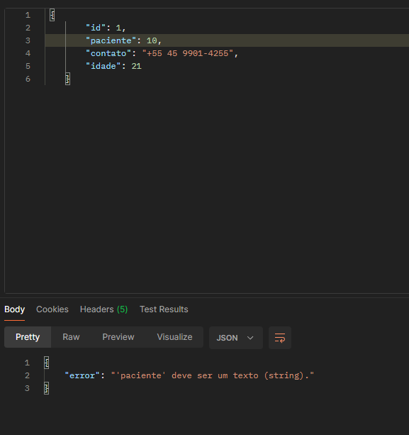

##  VALIDAÇÃO/sangue
Arquivo: Endpoint /sangue (API Flask)
O que faz: Recebe e valida dados relacionados ao tipo sanguíneo e quantidade doada via requisição POST.
Foco: Verifica se o campo sangue existe e se é do tipo texto (string), utilizando isinstance, além de validar a presença do campo quantidade.
Uso: Utilizado para garantir que as informações sobre o sangue doado estejam corretas antes de serem processadas ou armazenadas no sistema.

Este trecho de código representa uma rota da API que recebe dados em formato JSON através de requisições do tipo POST. Ele valida se o campo sangue foi informado corretamente e utiliza a função isinstance para garantir que o valor seja do tipo string. Também verifica a existência do campo quantidade. Caso alguma validação falhe, retorna uma mensagem de erro com código HTTP apropriado. Isso assegura a integridade dos dados no controle de doações de sangue.

##  VALIDAÇÃO/estoque
Arquivo: Validação de dados de estoque/doação (API Flask)
O que faz: Recebe e valida informações sobre o tipo de sangue e quantidade disponível via requisição POST.
Foco: Verifica se o campo tipo existe, se não está vazio e se é do tipo texto (string), utilizando isinstance, além de validar a presença do campo quantidade.
Uso: Utilizado para garantir que os dados relacionados ao tipo sanguíneo estejam corretos antes de serem registrados no sistema de estoque de sangue.

Este trecho de código representa uma validação dentro de uma rota da API que recebe dados em formato JSON. Ele verifica se o campo tipo foi informado corretamente e utiliza a função isinstance para garantir que o valor seja do tipo string. Também valida se o campo quantidade está presente. Caso alguma dessas verificações falhe, retorna uma mensagem de erro com código HTTP apropriado. Isso assegura a consistência dos dados no controle de estoque de sangue.

## Tabelas de Validação das Rotas POST

### POST /doadores

| Rota       | Método | Campo    | Tipo esperado | Obrigatório |
|------------|--------|----------|---------------|-------------|
| /doadores  | POST   | paciente | string        | Sim         |
| /doadores  | POST   | idade    | inteiro       | Sim         |

**Exemplo de mensagens de erro para POST /doadores:**

| Campo    | Situação       | Mensagem retornada                  | Status code |
|----------|----------------|-------------------------------------|-------------|
| paciente | ausente        | O campo 'paciente' é obrigatório.   | 400         |
| paciente | tipo inválido  | 'paciente' deve ser um texto (string). | 422      |
| idade    | ausente        | O campo 'idade' é obrigatório.      | 400         |
| idade    | tipo inválido  | 'idade' deve ser um número inteiro. | 422         |

### POST /estoque

| Rota     | Método | Campo      | Tipo esperado | Obrigatório |
|----------|--------|------------|---------------|-------------|
| /estoque | POST   | tipo       | string        | Sim         |
| /estoque | POST   | quantidade | inteiro       | Sim         |

**Exemplo de mensagens de erro para POST /estoque:**

| Campo      | Situação       | Mensagem retornada                  | Status code |
|------------|----------------|-------------------------------------|-------------|
| tipo       | ausente        | O campo 'tipo' é obrigatório.       | 400         |
| tipo       | tipo inválido  | 'tipo' deve ser um texto (string).  | 422         |
| quantidade | ausente        | O campo 'quantidade' é obrigatório. | 400         |
| quantidade | tipo inválido  | 'quantidade' deve ser um número inteiro. | 422      |

### POST /sangue

| Rota    | Método | Campo      | Tipo esperado | Obrigatório |
|---------|--------|------------|---------------|-------------|
| /sangue | POST   | sangue     | string        | Sim         |
| /sangue | POST   | quantidade | inteiro       | Sim         |
| /sangue | POST   | data       | string        | Não         |

**Exemplo de mensagens de erro para POST /sangue:**

| Campo      | Situação       | Mensagem retornada                  | Status code |
|------------|----------------|-------------------------------------|-------------|
| sangue     | ausente        | O campo 'sangue' é obrigatório.     | 400         |
| sangue     | tipo inválido  | 'sangue' deve ser um texto (string).| 422         |
| quantidade | ausente        | O campo 'quantidade' é obrigatório. | 400         |
| quantidade | tipo inválido  | 'quantidade' deve ser um número inteiro. | 422      |
| data       | tipo inválido  | 'data' deve ser um texto (string).  | 422         |

**Status codes utilizados**

| Código | Situação                          |
|--------|-----------------------------------|
| 201    | Recurso criado com sucesso        |
| 400    | Campo obrigatório ausente         |
| 422    | Campo presente, mas com tipo de dado inválido |

## ID doadores
O que faz: Realiza a busca de doadores cadastrados no sistema com base em parâmetros enviados na requisição.

Foco: Filtra os dados dos doadores principalmente pelo campo idade (ou id, dependendo da consulta), retornando nome do paciente, contato e idade.

Uso: Utilizado para consultar e listar voluntários já cadastrados, permitindo buscas específicas através de parâmetros na URL (query params).

Este endpoint retorna os dados dos doadores em formato JSON. A busca é feita a partir de parâmetros informados na requisição (ex: ?idade=21), permitindo localizar e visualizar os registros que atendem aos critérios definidos.

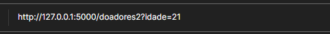

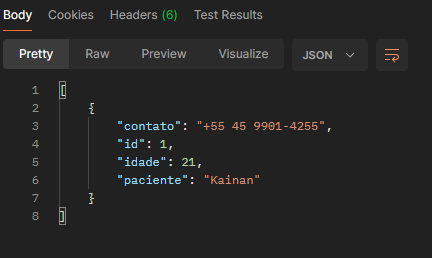

http://127.0.0.1:5000/doadores2?idade=21 (URL QUE USEI)

BUSCA POR ID (doadores)

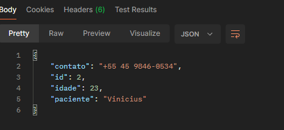

ID NÃO ENCONTRADO

Como funciona
<int:id> → captura o ID da URL
percorre a lista
se encontrar → retorna o objeto
se não → retorna erro 404

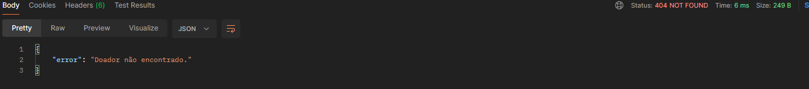

## ID estoque
O que faz: Realiza a busca de informações no estoque com base no identificador (id) enviado na requisição.
Foco: Retorna os dados do estoque vinculados ao doador, incluindo nome do doador, localização do estoque e tipo sanguíneo.
Uso: Utilizado para consultar registros específicos do estoque, permitindo localizar um item exato através do parâmetro informado na URL (ex: ?id=2).
Este endpoint retorna os dados do estoque em formato JSON. A busca é feita a partir do parâmetro id enviado na requisição, permitindo identificar e visualizar informações detalhadas de um registro específico dentro do sistema.

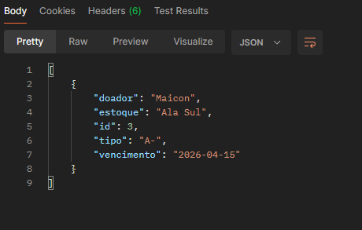

http://127.0.0.1:5000/estoque2?doador=Maicon (URL QUE USEI)

BUSCAR POR ID (estoque)

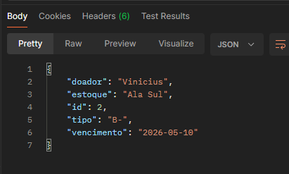

ID NÃO ENCONTRADO

Como funciona
<int:id> → captura o ID da URL
percorre a lista
se encontrar → retorna o objeto
se não → retorna erro 404

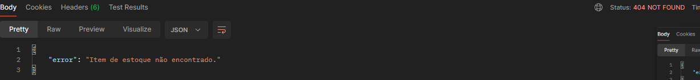

## ID sangue
O que faz: Realiza a busca de um registro específico relacionado a doadores de sangue a partir do identificador (id) informado na rota.

Foco: Retorna os dados do paciente, incluindo nome, contato e idade, com base no id fornecido.

Uso: Utilizado para consultar um doador específico diretamente pela URL, permitindo acesso rápido a um único registro (ex: /sangue/2).

Este endpoint retorna os dados em formato JSON. A busca é feita utilizando o id diretamente na rota, possibilitando a identificação e visualização de um registro específico dentro do sistema.

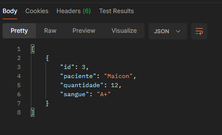

http://127.0.0.1:5000/sangue2?paciente=Maicon (URL QUE USEI)

BUSCA POR ID (sangue)

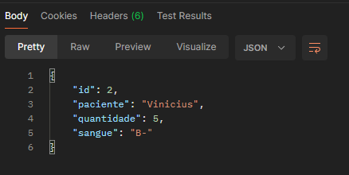

ID NÃO ENCONTRADO

Como funciona
<int:id> → captura o ID da URL
percorre a lista
se encontrar → retorna o objeto
se não → retorna erro 404

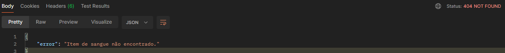

## DELETE
DELETE  /doadores/<id>
Remove permanentemente um doador do arquivo de armazenamento (doadores.json). Não requer body.

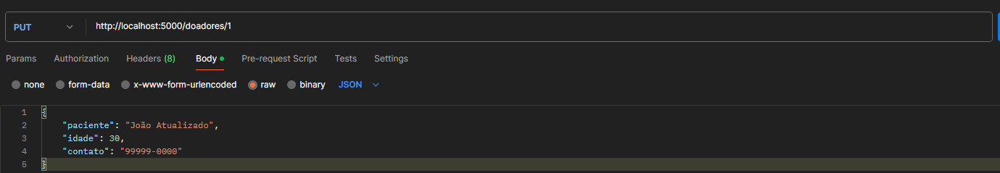

 ## ID inexistente (deve retornar 404) ##

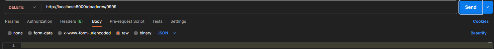

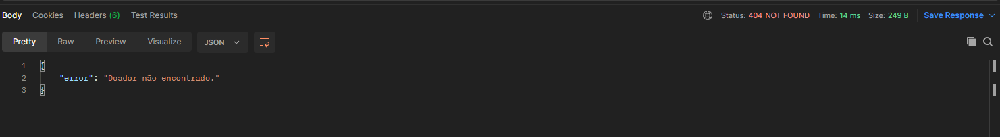

## PUT
Atualiza completamente um item do estoque de sangue. O campo id é preservado conforme o parâmetro de path.
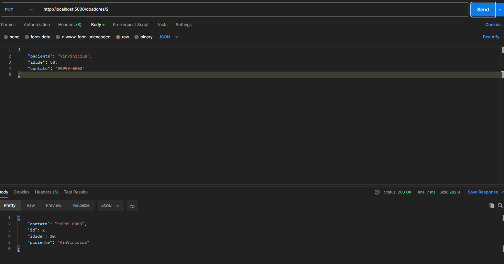

 ## ID inexistente (deve retornar 404) ##

 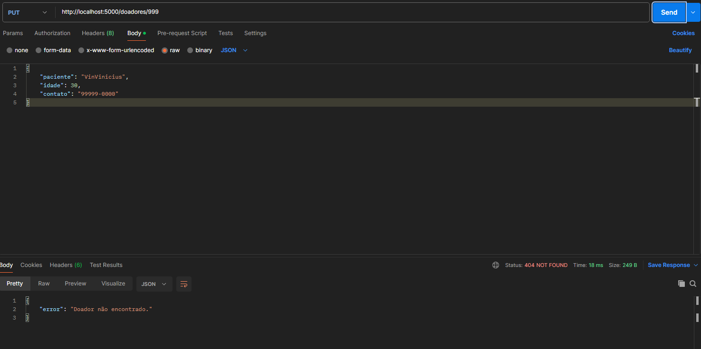

